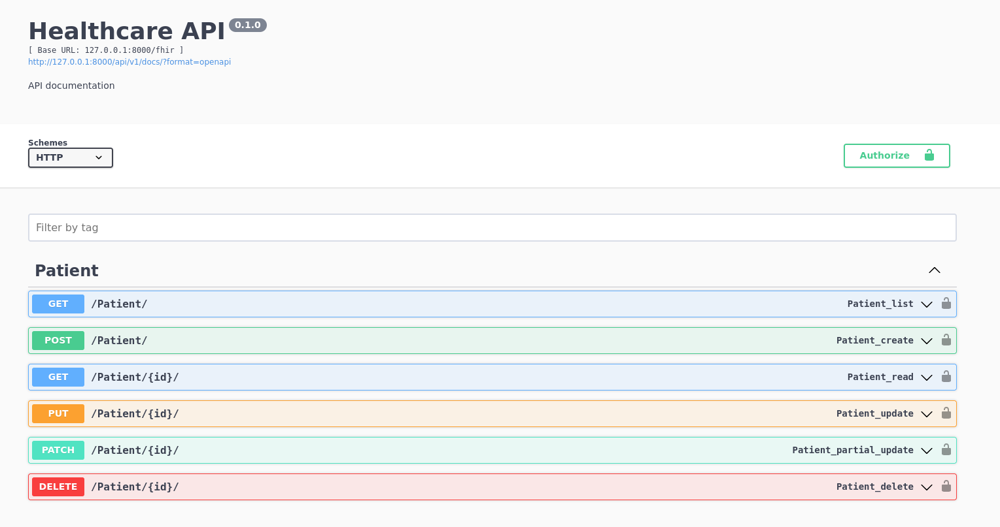

# Healthcare Patient Management

## Dev Environment

### Database setup
- Fill the file `src/app/healthcare/healthcare/.dev.env` with the needed information.
- Start the database service.
```commandline
$ docker compose --env-file src/app/healthcare/healthcare/.dev.env -f docker-compose.dev_db.yml up --build -d
```
### Python setup
On this project is used the `uv` tool.<br/>
Please check the documentation on link below.<br/>
https://github.com/astral-sh/uv

- Initialize the `uv` project.
```commandline
$ uv init
```
- Download a Python version. e.g.
```commandline
$ uv venv --python 3.13
```
- Install the project dependencies.
```commandline
$ uv pip install -e .
$ uv pip install -e .[dev]
```
- Create the `.lock` file.
```commandline
$ uv lock
```

### Django setup
- Go to path `src/app/healthcare/`
```commandline
$ cd src/app/healthcare/
```
- Start the migrations by running the following commands:
```commandline
$ python manage.py makemigrations --settings=healthcare.dev_settings
$ python manage.py migrate --settings=healthcare.dev_settings
```
- To create an user.
```commandline
$ python manage.py createsuperuser --settings=healthcare.dev_settings
```
- Start the app server.
```commandline
$ python manage.py runserver --settings=healthcare.dev_settings
```

## Unit Tests Environment
### Database setup
- Fill the file `src/app/healthcare/healthcare/.tests.env` with the needed information.
- Start the database service.
```commandline
$ docker compose --env-file src/app/healthcare/healthcare/.tests.env -f docker-compose.tests_db.yml up --build -d
```
### Migrations
- If did not execute the command `makemigrations` earlier.
```commandline
$ python manage.py makemigrations --settings=healthcare.tests_settings
```
- Run the migrations on the database for tests.
```commandline
$ python manage.py migrate --settings=healthcare.tests_settings
```
- Run the unit tests.
```commandline
$ python manage.py test --settings=healthcare.tests_settings
```

## Production Environment
- Fill the file `.env` with the needed information.
- Build the services in the containers.
```commandline
$ docker compose up --build -d
```
#### NOTE: The host and port which will be exposed and accessible are defined on the following env vars:
- REVERSE_PROXY_HOST
- REVERSE_PROXY_PORT

## API Documentation URL
### As mentioned, the host and port will be defined in `.env` files.
#### e.g. http://127.0.0.1:8000/api/v1/docs/

